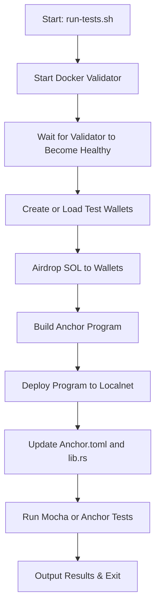

# Beargrease v1.0.0

[](https://github.com/rgmelvin/beargrease-by-cabrillo/actions/workflows/ci.yml)

A transparent, script-driven Solana Anchor test harness using Docker.

**Beargrease** makes it simple to spin up a local Solana validator, fund isolated test wallets, deploy Anchor programs, and run tests — all in a clean, reproducible Docker container.

---

## 🧠 Why Beargrease Exists

Beargrease was developed out of frustration with brittle, opaque, or overly complex test setups in Solana development. It solves real pain points encountered during professional-grade smart contract development and abstracts them into a reliable, reproducible, Docker-driven workflow.

It is not a toy. It is the infrastructure I built when existing tooling wasn’t enough — and I’ve spent the time to make it usable by others.

---

## 🧭 Overview

Beargrease is designed for developers who want a clean, zero-conflict environment for testing Solana smart contracts. By wrapping `solana-test-validator` in a Docker container with carefully sequenced scripts, Beargrease:

- Avoids conflicts with local Solana CLI or wallet config
- Funds dedicated test wallets with localnet SOL
- Automatically builds and deploys your Anchor programs
- Runs your test suite using a standard `mocha` runner
- Provides readable logs and clear errors for debugging

---

## 🧩 System Flow Diagram



This diagram shows the linear, script-driven flow Beargrease executes when you run `run-tests.sh`. All steps are transparent and customizable.

---

## 📁 Directory Structure

```
beargrease/
├── Dockerfile
├── docker-compose.yml
├── scripts/
│   ├── airdrop.sh
│   ├── create-test-wallet.sh
│   ├── fund-wallets.sh
│   ├── run-tests.sh
│   ├── update-program-id.sh
│   ├── version.sh
│   └── wait-for-validator.sh
├── .gitignore
├── .dockerignore
├── README.md
└── docs/
    ├── BeginnerGuide.md
    └── DockerInstall.md
```

---

## 🚀 Quick Start

Run this from your Anchor project folder:

```bash
../beargrease/scripts/run-tests.sh
```

This automatically:
- Builds and launches the Docker validator
- Waits until the RPC is healthy
- Builds and deploys your Anchor program
- Airdrops SOL to your test wallet(s)
- Runs your Mocha tests

---

## ✅ Using Beargrease as a GitHub Action

You can also use Beargrease in your GitHub CI workflows:

### 1. **Add to your workflow**

```
- name: 🐻 Run Beargrease
  uses: rgmelvin/beargrease-by-cabrillo@v1
  with:
    wallet-secret: ${{ secrets.TEST_USER_KEYPAIR }}
```

This invokes Beargrease as a GitHub Action. It starts a Dockerized Solana validator, deploys your Anchor program, runs your tests, and shuts down — exactly as it would when used locally.

### 2. **Define the required secret**

You must define a GitHub secret called `TEST_USER_KEYPAIR` in your repository.
 It should contain a **JSON array** (your test wallet keypair) like this:

```
[213,12,99,42, ...]
```

This secret will be written to `.ledger/wallets/test-user.json` inside the GitHub Actions runner.

To generate a wallet locally:

```
solana-keygen new --no-bip39-passphrase --outfile .ledger/wallets/test-user.json
cat .ledger/wallets/test-user.json
```

Copy the output and paste it as the `TEST_USER_KEYPAIR` secret in your repository settings.

---

## 🛠️ Scripts

| Script                  | Description |
|------------------------|-------------|
| `create-test-wallet.sh`| Generates and saves new local test wallets in `.ledger/wallets/` |
| `airdrop.sh`           | Interactive, container aware airdrop script for funding test wallets - trims input, validates amount, guides the user |
| `fund-wallets.sh`      | Funds multiple test wallets with localnet SOL |
| `wait-for-validator.sh`| Blocks until the validator’s RPC endpoint is healthy |
| `update-program-id.sh` | Replaces `lib.rs` and `Anchor.toml` program ID after deployment |
| `run-tests.sh`         | Orchestrates full test flow from Docker boot to test execution |
| `version.sh`           | Prints the Solana version used inside the container |

---

## 🐳 Docker Details

Beargrease wraps the Solana test validator in a lightweight container using this base image:

```dockerfile
solanalabs/solana:latest
```

**Ports exposed:**
- `8899` – RPC (used by Anchor)
- `8900` – Gossip
- `8001` – Faucet

No Solana CLI or Anchor CLI installation is required on the host — everything runs inside Docker.

---

## 📚 Documentation

- 📘 [Beginner Guide](./docs/BeginnerGuide.md) – Full walk-through of setup and usage
- 🔧 [Docker Install Guide](./docs/DockerInstall.md) – For Linux, macOS, WSL

---

## 🛡️ Attribution

This project was created and maintained by Richard G. Melvin, founder of Cabrillo!, Labs.

If you use Beargrease in your own work, please credit the project by linking back to this repository and mentioning Cabrillo!, Labs.

See [LICENSE](./LICENSE) for terms.

---

## 🐻 Why “Beargrease”?

Named after the legendary John Beargrease, the North Shore mail carrier who braved the harshest winters to deliver with reliability. This tool does the same for your Solana test pipeline.

---

## 🧬 About the Author

I'm Richard G. Melvin, founder and sole developer at Cabrillo!, Labs. I hold a Ph.D. in Biochemistry and Molecular Genetics, and I'm self-taught in systems programming, smart contracts, and the broader world of decentralized infrastructure.

Beargrease is part of my ongoing effort to build reliable, decentralized mechanisms that give scientists and independent researchers ownership over their work—and to help more people and businesses engage meaningfully with Web3.

---

## 📜 License

MIT © Cabrillo!, Labs  
📫 cabrilloweb3@gmail.com
