# 🐻  Beargrease

[](LICENSE)
[](#github-ci-mode)
[](#%EF%B8%8F-how-it-works)
[](https://docs.solana.com/developing/test-validator/using-test-validator)
[](#script-execution-order)

*Solana Anchor testing that just works*

**Reliable Solana test automation, without the guesswork.**
Beargrease is a fast, transparent, environment-aware, script-driven test harness for Solana Anchor programs. It automates validator startup, wallet setup, program deployment, and test execution for both local development and GitHub Actions Continuous Integration (CI).

---

## Table of Contents

- [Version & Maintainer](#version--maintainer)
- [What is Beargrease?](#what-is-beargrease)
- [What Beargrease Does](#what-beargrease-does)
- [✨ Features](#-features)
- [⚠️ Two Modes of Use](#️-two-modes-of-use)
- [Quick Start - Local & CI](#quick-start---local--ci)
- [📚 Beginner Guides](#-beginner-guides)
- [Example: Placebo Test Project](#example-placebo-test-project)
- [🧠 Smart by Design](#-smart-by-design)
- [Architecture & Flow](#architecture--flow)
- [Script Execution Order](#script-execution-order)
- [🧰 Script Reference](#-script-reference)
- [🐞 Troubleshooting & Support](#-troubleshooting--support)
- [🔐 Security Notice](#-security-notice)
- [👩‍🔬 For Developers](#-for-developers)
- [Preview of `bg-testkit/` Purpose and Vision](#preview-of-bg-testkit-purpose-and-vision)
- [🛡️ Attribution](#️-attribution)
- [🐻 Why “Beargrease”?](#-why-beargrease)
- [About the Author](#about-the-author)
- [License](#license)

---


## Version & Maintainer

- **Version:** v1.1.0
- **Maintained by:** Cabrillo! Labs
- **Contact:** cabrilloweb3@gmail.com
- **License:** MIT
- **GitHub:** [github.com/rgmelvin/beargrease-by-cabrillo](https://github.com/rgmelvin/beargrease-by-cabrillo)

---

## What is Beargrease?

Beargrease is a developer-first harness that brings **clarity and reliability** to Solana Anchor testing. It senses whether it is running in CI or locally and adapts automatically - so you don't need to configure mode switches or rewrite test logic. Everything is visible, traceable, and scriptable. Beargrease not only detects your environment - it also detects your test language. If you give it Mocha tests (.mts, .ts, or .js) then it runs Mocha. If you give it Rust tests (.rs) then it runs `anchor test`

Beargrease:

- Detects your test environment - local or GitHub CI
- Spins up a Docker-based `solana-test-validator`
- Deploys your program and auto-injects its ID
- Creates and funds local or CI wallets
- Runs TypeScript tests using Mocha (ESM compatible) or Rust tests using `anchor test`
- Shuts everything down cleanly

Beargrease was built to end fragile validator setups and to give developers tools that they can trust.

---


## What Beargrease Does

Beargrease coordinates your entire test lifecycle using portable shell scripts:

- 🐳 Starts a local `solana-test-validator` in Docker
- 🔐 Handles wallet creation or decoding (local or CI)
- 📂 Detects environment and test framework
- 📌 Injects deployed program ID into `Anchor.toml` and `lib.rs`
- 🧪 Runs either `mocha` (TypeScript) or `anchor test` (Rust), based on files present
- 🧹 Cleans up wallet and validator state appropriately

Whether in GitHub CI or on your machine, Beargrease adapts automatically.

---


## ✨ Features

- 🧠 **Environment-Aware**  
  Automatically detects whether you are running locally or inside GitHub CI and adapts wallet handling, validator timing, file paths, and execution accordingly.

- 🐳 **Validator Lifecycle via Docker**  
  Starts and stops a dedicated `solana-test-validator` container for each run. Isolated, reliable, and zero-conflict.

- 🔐 **Wallet Management**  
  - Local: creates keypairs under `.ledger/wallets/`
  - CI: decodes `BEARGREASE_WALLET_SECRET` into container runtime

- 📌 **Program ID Injection**  
  Dynamically updates `Anchor.toml` and `lib.rs` with the deployed program ID.

- 🧪 **Mocha or Anchor Test Detection**  
  Chooses test runner based on what files are present.

- 📚 **Beginner-Friendly**  
  Includes a visual architecture diagram, step-by-step beginner guides, and transparent script control.

---


### 🧠 Smart by Design

Beargrease uses environment detection internally to choose the correct paths:

- `.ledger/wallets/...` for local use
- `/wallet/id.json` via `init-wallet.sh` in CI
- Automatically selects wait times, injects program ID, and chooses `anchor test` or `mocha` as needed

You do not have to configure anything else. Just run `run-tests.sh`.

---


## ⚠️ Two Modes of Use

Beargrease supports two primary modes of operation:

🖥️ Local Mode (runs test on your machine) and ☁️ CI Mode (runs tests in GitHub Actions). But you rarely need to decide anything - Beargrease senses the environment, selects the correct wallet strategy, and proceeds transparently.

| Mode         | Description                                         | Use When...                           |
| ------------ | --------------------------------------------------- | ------------------------------------- |
| 🖥️ Local Mode | Run tests manually using Docker on your dev machine | You're actively building or debugging |
| ☁️ CI Mode    | Runs in GitHub Actions using dynamic repo checkout  | You want automated tests on push/PR   |

### 📘 Choose the right guide:

- 👉 [Beginner Guide – Local Mode (v1.0.x)](docs/BeginnerGuide.md)
- 👉 [Beginner Guide – CI Mode (v1.1.0+)](docs/BeginnerGuide-CI.md)

---


## Quick Start - Local & CI

### Usage Modes

Beargrease supports both **Local Mode** and **GitHub CI Mode**, using the *same scripts*. It detects the environment automatically and adapts validator startup, wallet management, and wait timing without requiring user intervention.

#### 🖥️ Local Mode (Developer Machine). (manual)

```
bashCopyEdit# From your Anchor project root
mkdir -p scripts
cp -r ../beargrease/scripts ./scripts/beargrease
chmod +x ./scripts/beargrease/*.sh

# Run full test suite
./scripts/beargrease/run-tests.sh
```

- 🐳 Spins up a Docker-based `solana-test-validator`
- 🔐 Loads or generates a wallet in `.ledger/wallets/`
- 🧪 Runs your Anchor tests after auto-patching the program ID

#### ☁️ GitHub CI Mode (Automated Testing)

```
yamlCopyEditjobs:
  test:
    steps:
      - name: 📥 Checkout project
        uses: actions/checkout@v4

      - name: 🐻 Checkout Beargrease
        uses: actions/checkout@v4
        with:
          repository: rgmelvin/beargrease-by-cabrillo
          path: beargrease

      - name: 🚀 Run Beargrease Test Harness
        run: ./beargrease/scripts/run-tests.sh
        env:
          BEARGREASE_WALLET_SECRET: ${{ secrets.WALLET_SECRET }}
```

- 🔐 Provide a GitHub Actions secret `WALLET_SECRET` (base64-encoded keypair)
  - Navigate to **GitHub → Settings → Secrets → Actions → New repository secret**
- Wallet is decoded inside the container; no local files are needed

------


## Example: Placebo Test Project

Want to see it in action? Visit the official demo repo:
👉 https://github.com/rgmelvin/placebo

Placebo is a minimal Anchor project fully integrated with Beargrease.

---


## 📚 Beginner Guides

- 🖥️ [Local Mode Guide (v1.0.x)](docs/BeginnerGuide.md)
- ☁️ [CI Mode Guide (v1.1.0+)](docs/BeginnerGuide-CI.md)

---


## Architecture & Flow

Beargrease works by orchestrating:

- 🐳 A Docker-based local Solana validator
- 🔐 Test wallet creation and airdrop
- 📌 Program deployment and ID patching
- 🧪 Mocha/ESM-compatible TypeScript test execution

---

### **Figure: Full Environment-Aware Execution Flow of Beargrease (v1.1.0+)**

The diagram below shows the complete Beargrease test harness flow as implemented in version 1.1.0+. A single entrypoint (`run-tests.sh`) is used in both **Local** and **CI** environments. The script **automatically detects** its execution context and invokes the appropriate wallet setup, validator timing, and cleanup procedures based on environment.

- **Local Mode**: The user manually copies Beargrease scripts into their project. Wallets are created using `create-test-wallet.sh` and persisted under `.ledger/wallets/`. Wait durations for validator and program indexing are kept short to optimize the developer feedback loop.
- **CI Mode**: A GitHub Actions workflow checks out the user's project and the Beargrease repo as a subdirectory. Wallets are securely decoded from `BEARGREASE_WALLET_SECRET` via `init-wallet.sh`. The system adapts wait durations to account for containerized validator startup times and indexing delays. Wallets are ephemeral and cleared upon container shutdown.

Throughout both flows, the same core scripts are used — but they alter behavior internally based on environment. This ensures users do **not** need to manually configure test harness differences between local development and CI pipelines. Even test runner selection (Mocha vs. Anchor) is determined dynamically.

The diagram also highlights script chaining behavior: for example, `run-tests.sh` calls `wait-for-validator.sh`, `update-program-id.sh`, and ultimately runs tests. Control flow and environment sensing are explicitly shown before every major step to reinforce Beargrease’s **transparent, adaptive architecture**.

```mermaid
flowchart TD
    %% Setup Phase
    A1[🖥️ Local: Copy Beargrease scripts into your project]
    A2[☁️ CI: Checkout your project repo and checkout Beargrease as subdirectory]
    A1 --> B[▶️ run-tests.sh]
    A2 --> B[▶️ run-tests.sh]

    %% Shared detection
    B --> DETECT[🧠 Detect Environment]
    DETECT --> Local_Entry_Point
    DETECT --> CI_Entry_Point

    %% Local Flow
    subgraph LOCAL [🖥️ Local Execution Path]
        direction TB
        Local_Entry_Point --> V1[▶️ start-validator.sh] --> V2[🐳 Start solana-test-validator via Docker]
        V2 --> W1[▶️ wait-for-validator.sh] --> W2[🧠 Detect Environment] --> W3[⏳ Short wait for validator healthcheck]
        W3 --> L1[🧠 Detect Environment] --> L2[▶️ create-test-wallet.sh] --> L3[🔐 Load wallet from .ledger/wallets/...]
        L3 --> U1[▶️ update-program-id.sh] --> U2[📌 Inject Program ID: Anchor.toml, lib.rs]
        U2 --> WP1[▶️ wait-for-program.ts] --> WP2[🧠 Detect Environment] --> WP3[🔍 Confirm program ID indexed -short wait]
        WP3 --> T1[▶️ run-tests.sh] --> T2[🧠 Detect Environment] --> T3[🧪 Run Mocha or Anchor tests]
        T3 --> CLEAN_LOCAL[🧹 Wallet persists in .ledger/wallets/]
    end

    %% CI Flow
    subgraph CI [☁️ GitHub CI Execution Path]
        direction TB
        CI_Entry_Point --> V3[▶️ start-validator.sh] --> V4[🐳 Start solana-test-validator via Docker]
        V4 --> W4[▶️ wait-for-validator.sh] --> W5[🧠 Detect Environment] --> W6[⏳ Long wait for validator healthcheck]
        W6 --> L4[🧠 Detect Environment] --> L5[▶️ init-wallet.sh] --> L6[🔐 Decode BEARGREASE_WALLET_SECRET]
        L6 --> U3[▶️ update-program-id.sh] --> U4[📌 Inject Program ID: Anchor.toml, lib.rs]
        U4 --> WP4[▶️ wait-for-program.ts] --> WP5[🧠 Detect Environment] --> WP6[🔍 Confirm program ID indexed -long wait]
        WP6 --> T4[▶️ run-tests.sh] --> T5[🧠 Detect Environment] --> T6[🧪 Run Mocha or Anchor tests]
        T6 --> CLEAN_CI[♻️ Wallet cleared when container exits]
    end

    %% Converged Exit
    CLEAN_LOCAL --> SHUTDOWN[🛑 Shut down validator]
    CLEAN_CI --> SHUTDOWN

```



---

## Script Execution Order

Beargrease coordinates a series of environment-aware scripts that prepare the Solana test validator, manage wallet access, inject the program ID, and run the correct test suite. The execution flow is **identical in both local and CI contexts**, but key scripts adapt their behavior based on the detected environment.

Below is a summary of script execution order and purpose, matched to the [Architecture & Flow Diagram](#architecture--flow).

### 🟢 Master Entry Point

| Script         | Purpose                                                      |
| -------------- | ------------------------------------------------------------ |
| `run-tests.sh` | The top-level orchestrator. Detects environment, launches validator, injects program ID, waits for indexing, and finally runs tests. This script calls nearly all others. |


------

### 🐳 Validator Launch Phase

| Script                  | Called By                                   | Purpose                                                      |
| ----------------------- | ------------------------------------------- | ------------------------------------------------------------ |
| `start-validator.sh`    | `run-tests.sh`                              | Shuts down any running validator, then starts a fresh Solana validator via Docker. |
| `wait-for-validator.sh` | `run-tests.sh` → after `start-validator.sh` | Waits until the validator passes a health check. Will be updated to wait longer in CI than local. (Environment-aware) |


------

### 🔐 Wallet Setup Phase

| Script                  | Called By                   | Purpose                                                      |
| ----------------------- | --------------------------- | ------------------------------------------------------------ |
| `create-test-wallet.sh` | `run-tests.sh` (local only) | Creates and stores a test wallet under `.ledger/wallets/`. Used only in local mode. |
| `init-wallet.sh`        | `run-tests.sh` (CI only)    | Decodes the `BEARGREASE_WALLET_SECRET` into `/wallet/id.json` inside the container. Used only in CI. |


------

### 📌 Program ID Injection Phase

| Script                 | Called By      | Purpose                                                      |
| ---------------------- | -------------- | ------------------------------------------------------------ |
| `update-program-id.sh` | `run-tests.sh` | Replaces the program ID in both `Anchor.toml` and `lib.rs` using the deployed address. Shared by both environments. |


------

### ⏳ Index Wait Phase

| Script                | Called By      | Purpose                                                      |
| --------------------- | -------------- | ------------------------------------------------------------ |
| `wait-for-program.ts` | `run-tests.sh` | Waits until the deployed program ID appears in the validator index. Wait time will be tuned by environment. (Environment-aware) |


------

### 🧪 Test Execution Phase

| Script         | Called By      | Purpose                                                      |
| -------------- | -------------- | ------------------------------------------------------------ |
| `run-tests.sh` | Self-contained | Automatically chooses between `anchor test` and Mocha (`*.test.mts`) based on presence of test files. This is environment-independent logic. |


------

### 🧹 Cleanup Phase

| Method                | Context | Behavior                                                     |
| --------------------- | ------- | ------------------------------------------------------------ |
| Wallet persists       | Local   | `.ledger/wallets/...` is retained unless manually deleted.   |
| Wallet cleared        | CI      | Secret wallet is mounted into container and discarded when the container exits. |
| `docker compose down` | Both    | Handled by `run-tests.sh` automatically, shutting down the validator at the end of the run. |

---


## 🧰 Script Reference

| Script                  | Purpose                      |
| ----------------------- | ---------------------------- |
| `start-validator.sh`    | Launch Docker validator      |
| `wait-for-validator.sh` | Await healthcheck success    |
| `create-test-wallet.sh` | Generate local wallet        |
| `airdrop.sh`            | Airdrop to a wallet          |
| `fund-wallets.sh`       | Batch fund wallets           |
| `update-program-id.sh`  | Patch program ID into config |
| `run-tests.sh`          | Run all steps and test suite |
| `version.sh`            | Echo Beargrease version      |

---

## 🐞 Troubleshooting & Support

If you run into issues:

- See the [Appendix B](docs/BeginnerGuide.md#appendix-b--troubleshooting-and-technical-reference) in the Beginner CI Guide
- Or email: **cabrilloweb3@gmail.com**

---

## 🔐 Security Notice

Beargrease generates and handles plaintext wallets. Never use real wallets or mainnet deployments.

- In local mode: keys live in `.ledger/wallets/`
- In CI: use ephemeral base64 secrets only
- Do not commit wallet files

If you suspect a security issue, email **cabrilloweb3@gmail.com**

---

## 👩‍🔬 For Developers

Beargrease is modular and extensible:

- ✅ [Mocha + ESM](https://github.com/rgmelvin/beargrease-by-cabrillo/blob/main/tests/placebo.test.mts) support built-in
- 🧪 [`bg-testkit/`](https://github.com/rgmelvin/beargrease-by-cabrillo/tree/main/bg-testkit) stub for future logging, snapshotting, and observability
- 🔧 Transparent shell-based control over lifecycle and test flow via [`scripts/`](https://github.com/rgmelvin/beargrease-by-cabrillo/tree/main/scripts)
- 📁 Scripts are portable, readable, and easy to adapt — especially [`run-tests.sh`](https://github.com/rgmelvin/beargrease-by-cabrillo/blob/main/scripts/run-tests.sh)

**Want to use a different test runner?**

Beargrease currently supports Mocha and Anchor (`anchor test`), but `run-tests.sh` could be adapted for additional runners (*e.g.*, Vitest, Jest, Ava).

Consider adding a `--runner` flag or customizing detection logic if your project uses a different testing framework.

Want to contribute? Fork it, tweak it, break it, fix it, go wild — and send a PR 🛠️

---


### **Preview of `bg-testkit/` Purpose and Vision**

| Feature                      | Description                                                  |
| ---------------------------- | ------------------------------------------------------------ |
| 📊 **Observability Tools**    | Capture logs, transaction details, and execution traces during tests. |
| 🧪 **Snapshot Support**       | Allow saving and comparing validator state snapshots across runs. |
| 📈 **Test Metrics**           | Emit timing and success/failure stats for test phases (e.g., validator boot, wallet injection, program indexing). |
| 🔁 **Replay/Test Harnessing** | Simulate test scenarios offline using cached state and deterministic input replay. |
| 🛠️ **Advanced Debugging**     | Include hooks or wrappers to diagnose CI-only failures, stuck state, or flaky setup timing issues. |

---


## 🛡️ Attribution

Created and maintained by **Richard G. Melvin**, founder of **Cabrillo! Labs**.
If you use Beargrease, please credit the project and link back to this repo.

---


## 🐻 Why “Beargrease”?

Named respectfully for **John Beargrease**, the Ojibwe, First American mail carrier who delivered the post by dog sled through blizzards and over frozen lakes along Minnesota’s North Shore in the 1800s.
Beargrease is built to deliver your tests with the same kind of reliability.

---


## About the Author

I’m **Richard (Rich) G. Melvin**, founder of Cabrillo! Labs. I hold a Ph.D. in Biochemistry and Molecular Genetics from UNSW, and I’m self-taught in systems programming, smart contracts, and decentralized infrastructure. Beargrease reflects my goal of building serious, approachable tools that help researchers and developers own their work in Web3.

---


## License

[MIT License](https://openshource.org/licenses/MIT)
© 2025 Cabrillo! Labs