# 🐻 Beargrease: Solana Test Harness

**Version:** v1.1.0  
**Maintained by:** Cabrillo! Labs  
**Contact:** cabrilloweb3@gmail.com  
**License:** MIT  
**GitHub:** [github.com/rgmelvin/beargrease-by-cabrillo](https://github.com/rgmelvin/beargrease-by-cabrillo)

---

> ⚠️ **Notice: Two Modes of Use**
>
> Beargrease supports two modes of operation:
>
> - **Local Mode** (for running tests manually on your development machine)
> - **Directory Checkout CI Mode** (for running tests automatically in GitHub Actions)
>
> 📘 Use the correct guide for your workflow:
>
> - 👉 [Beginner’s Guide for Local Mode (v1.0.x)](./docs/BeginnerGuide.md)
>
> - 👉 [Beginner’s Guide for Directory Checkout Mode for CI (v1.1.0)](./docs/BeginnerGuide-CI.md)
>
>   

---

## 📦 What’s in This Repository

Beargrease is a developer-focused harness for Solana test automation, featuring:

- A suite of bash scripts and TypeScript helpers for Solana validator management
- CI-compatible test runner using GitHub Actions and Docker
- Manual local test mode with copy-paste integration into Anchor projects
- Modular structure to enable reuse across multiple projects

## 🧭 What is Beargrease?

Beargrease is a transparent, script-driven test harness for Solana Anchor programs. It helps you:

- Spin up a local `solana-test-validator` container.
- Airdrop and fund test wallets.
- Deploy and index your program.
- Run Mocha/Anchor-based TypeScript or JavaScript tests.
- Automatically clean up the environment after tests complete.

Beargrease was created to address the persistent fragility of local validator setups in Solana CI, making developer test environments reliable, repeatable, and visible.

---

## 📦 Features

- ✅ Script-based validator launch and teardown
- ✅ Auto program deployment and ID patching
- ✅ Local and CI compatibility
- ✅ Supports Anchor v0.31.1+ and Mocha ESM test runners
- ✅ Beginner-friendly documentation with visual guides

---

## 🧪 Modes of Use

| Mode                 | Description                                               | Use When...                                           |
| -------------------- | --------------------------------------------------------- | ----------------------------------------------------- |
| 🖥️ Local Mode         | Runs on your machine, using Docker and shell scripts      | You want to manually test programs during development |
| ⚙️ Directory Checkout | Clones Beargrease into your CI project and runs in GitHub | You want your test suite to run in CI automatically   |

📘 Each mode has a dedicated guide:

- Local Mode: [`BeginnerGuide.md`](./docs/BeginnerGuide.md)
- CI Mode: [`BeginnerGuide-CI.md`](./docs/BeginnerGuide-CI.md)

---

## ⚙️ Beargrease Architecture and Script Roles

Beargrease works by orchestrating:
- 🐳 A Docker-based local Solana test validator
- 🧪 Dynamic wallet creation and funding
- 📜 Program ID updates in `Anchor.toml` and `lib.rs`
- 🧬 ESM-compatible TypeScript test execution

| Script                  | Purpose                           |
| ----------------------- | --------------------------------- |
| `start-validator.sh`    | Launches the Docker validator     |
| `wait-for-validator.sh` | Waits until validator is healthy  |
| `create-test-wallet.sh` | Generates and saves test wallet   |
| `airdrop.sh`            | Airdrops SOL to a wallet          |
| `fund-wallets.sh`       | Batch funds multiple wallets      |
| `update-program-id.sh`  | Replaces the deployed program ID  |
| `run-tests.sh`          | Entry point for running all steps |
| `version.sh`            | Echoes Beargrease version         |

---

## 🧰 How to Use Beargrease Locally (v1.0.x)

Use the [Beginner’s Guide for Local Mode](./docs/BeginnerGuide.md) to:

- Copy the Beargrease `scripts/` directory into your Anchor project
- Run tests using the local Docker validator
- Airdrop and fund test accounts
- Debug program interactions locally

---

## 🧪 How to Use Beargrease in GitHub CI (v1.1.0+)

Use the [Beginner’s Guide to Directory Checkout Mode for CI](./docs/BeginnerGuide-CI.md) to:

- Clone Beargrease alongside your project in `.github/workflows`
- Create and use a base64-encoded wallet secret
- Auto-inject validator, wallet, and IDL setup before tests
- Run full integration tests in CI with no local setup

---

## 🧭 How to Choose Between Modes

| Mode       | Use When...                                       |
| ---------- | ------------------------------------------------- |
| Local Mode | You're developing or debugging manually           |
| CI Mode    | You need automated test runs on GitHub pushes/PRs |

---

## 📚 Documentation & Guides

- [Beginner’s Guide for Local Mode](./docs/BeginnerGuide.md)
- [Beginner’s Guide for GitHub CI](./docs/BeginnerGuide-CI.md)

---

## **Beargrease Dual-Mode Cheat Sheet**

> Quick reference for running Beargrease in **Local Mode** or **CI Mode**
>  💡 Remember: Local Mode copies Beargrease into your project. CI Mode checks it out dynamically.

------

### 🐻 Local Mode (Manual Developer Workflow)

**Setup**

```bash
# From your project root
mkdir -p scripts
cp -r ../beargrease-by-cabrillo/scripts ./scripts/beargrease
chmod +x ./scripts/beargrease/*.sh
```

**Run Test Suite**

```bash
./scripts/beargrease/run-tests.sh
```

**Test Wallets**

```bash
# Create
./scripts/beargrease/create-test-wallet.sh
# Airdrop
./scripts/beargrease/airdrop.sh test-user
```

**Update Program ID**

```bash
./scripts/beargrease/update-program-id.sh
```

------

### 🧪 GitHub CI Mode (Directory Checkout v1.1.0)

**`.github/workflows/test.yml`**

```yaml
jobs:
  test:
    steps:
      - name: 📥 Checkout project
        uses: actions/checkout@v4

      - name: 🐻 Checkout Beargrease
        uses: actions/checkout@v4
        with:
          repository: rgmelvin/beargrease-by-cabrillo
          path: beargrease

      - name: 🚀 Run Tests
        run: ./beargrease/scripts/run-tests.sh
        env:
          BEARGREASE_WALLET_SECRET: ${{ secrets.WALLET_SECRET }}
```

**Add CI secret:**

- Go to **GitHub > Settings > Secrets > Actions**
- Add secret named `WALLET_SECRET` with base64-encoded Solana keypair JSON

**CI Logs**

- Will show validator health, airdrops, and test execution
- Automatically injects program ID

------

## Beargrease Dual-Mode Flow Diagrams

### 🐻 **Local Mode Flow (v1.0.x)**

```mermaid
flowchart TB
    A1[📂 Copy Beargrease scripts into your project] --> 
    A2[🚀 Run ./scripts/beargrease/run-tests.sh] --> 
    A3[🐳 Start solana-test-validator via Docker] --> 
    A4[🕓 Wait for validator to pass healthcheck] --> 
    A5[🧪 Run Anchor tests using local wallet] --> 
    A6[🛑 Stop validator container]
```




### 🐻 ** CI Mode Flow (v1.1.0 Directory Checkout Mode)**

```mermaid
flowchart TB
    B1[📥 Checkout your project repo] --> 
    B2[📥 Checkout Beargrease repo in a subdirectory] --> 
    B3[🚀 Run ./beargrease/scripts/run-tests.sh] --> 
    B4[🐳 Start solana-test-validator via Docker] --> 
    B5[🔐 Decode BEARGREASE_WALLET_SECRET into container] --> 
    B6[📌 Inject deployed Program ID into Anchor.toml] --> 
    B7[🧪 Run Anchor tests inside GitHub Actions] --> 
    B8[🛑 Stop validator container]
```



## 🐞 Troubleshooting and Support

If you get stuck, consult:

- **Appendices** in either beginner guide
- The visual [flowchart troubleshooting key](./docs/troubleshooting-mermaid.md)
- Reach out: **cabrilloweb3@gmail.com**

---

## 👩‍🔬 For Developers: Extending Beargrease

Beargrease was built for modularity and future-proofing:

- ESM-friendly test execution
- Pluggable validator config
- Versioned CLI compatibility
- `bg-testkit/` stub available for extending CI logic

Want to contribute? Fork and go wild 🛠️

---

## 🛡️ Attribution

This project was created and maintained by Richard G. Melvin, founder of Cabrillo!, Labs.

If you use Beargrease in your own work, please credit the project by linking back to this repository and mentioning Cabrillo!, Labs.

See [LICENSE](https://github.com/rgmelvin/beargrease-by-cabrillo/blob/main/LICENSE) for terms.

------

## 🐻 Why “Beargrease”?

Named after the legendary John Beargrease, the Native American mail carrier who braved the harshest winters along the North Shore of Lake Superior to deliver with reliability. This tool does the same for your Solana test pipeline.

------

## 🧬 About the Author

I'm Richard (Rich) G. Melvin, founder and sole developer at Cabrillo!, Labs. I hold a Ph.D. in Biochemistry and Molecular Genetics from the University of New South Wales, and I'm self-taught in systems programming, smart contracts, and the broader world of decentralized infrastructure.

Beargrease is part of my ongoing effort to build reliable, decentralized mechanisms that give scientists and independent researchers ownership over their work—and to help more people and businesses engage meaningfully with Web3.

## 🧾 License

MIT License  
© 2025 Cabrillo! Labs