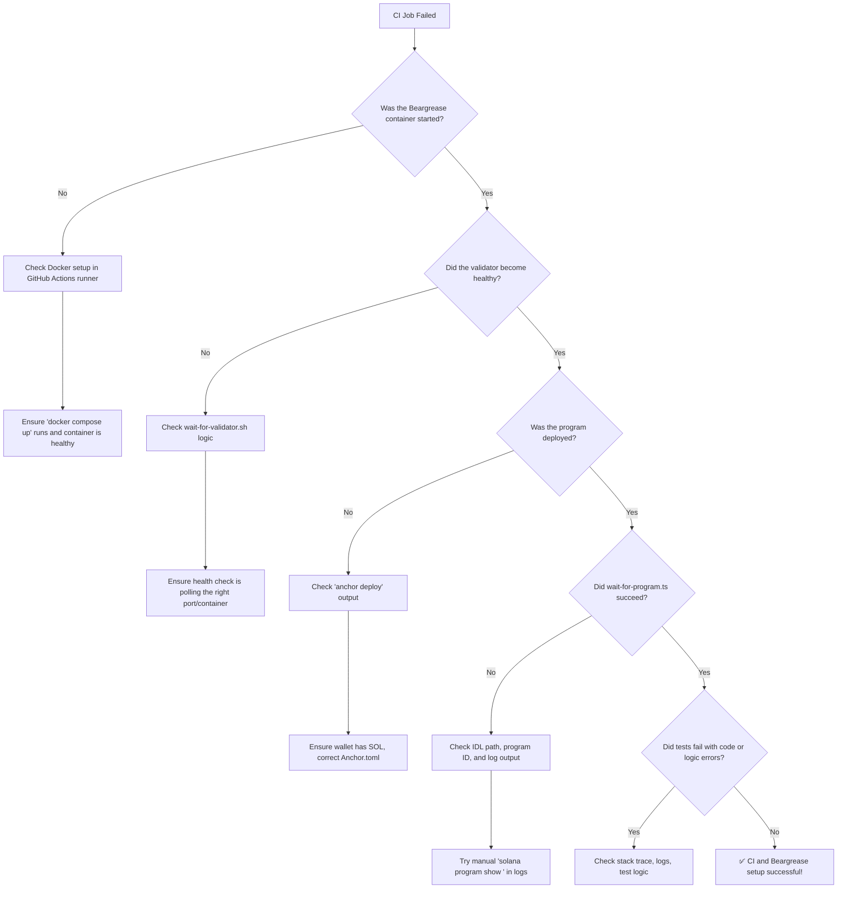

# Beginner’s Guide for Beargrease v1.1.0  

> ⚠️ **Archived Guide**
> 
> This document was part of a prior working draft or release.
> 
> Please use the updated version here: [📘 Beginner Guide v1.1.0](../BeginnerGuide.md)

## Directory Checkout Mode for GitHub CI

**Maintained by:** Cabrillo! Labs  
**Contact:** [cabrilloweb3@gmail.com](mailto:cabrilloweb3@gmail.com)  
**GitHub:** [https://github.com/rgmelvin/beargrease-by-cabrillo](https://github.com/rgmelvin/beargrease-by-cabrillo)

---

## Abstract

Beargrease v1.1.0 introduces a fully CI-compatible “Directory Checkout Mode” that enables seamless test harness execution for Solana Anchor projects on GitHub Actions. This mode was developed by **Cabrillo! Labs** to address a recurring gap in Solana development workflows: the absence of a lightweight, transparent, and reproducible solution for managing program builds, local validator setup, wallet injection, and test execution *within* CI pipelines.

Previous approaches often required ad hoc scripting or heavyweight Docker orchestration, leaving most Solana teams to improvise CI integration. Beargrease now offers a standardized alternative — a script-based harness that runs tests exactly as developers do locally, but automated through GitHub Actions.

This guide provides detailed instructions for using Beargrease in **Directory Checkout Mode**, where the `beargrease-by-cabrillo` repository is checked out as a submodule or directly alongside your test project. No NPM packages, marketplace Actions, or publishing overhead are required.

If you are running tests **locally**, refer instead to the [original Beargrease Beginner Guide](./BeginnerGuide.md). The present guide is specifically for users adopting **v1.1.0+** and integrating with GitHub CI.

---

## 1. Overview — What This Guide Covers and When to Use It

This guide walks you through using **Beargrease v1.1.0** in a GitHub Actions CI pipeline by directly checking out the `beargrease-by-cabrillo` repository alongside your Anchor test project.

Beargrease in **Directory Checkout Mode** does not require publishing or installing a GitHub Action. Instead, it uses standard CI techniques: clone both repos, run the provided scripts, and execute your test suite in a way that mirrors local developer workflows.

### ✅ You should use this guide if:

- You want to **run Solana Anchor tests in GitHub CI** (e.g., via `npm test`, `mocha`, `ts-mocha`, etc.).
- You want **fast test feedback** in PRs without maintaining your own validator scripts.
- You want to **avoid opaque GitHub Actions** and understand every part of your test flow.
- You are testing a project that uses Beargrease as a **side-by-side repo**, e.g.,  
  `Projects/cabrillo/placebo` and `Projects/cabrillo/beargrease-by-cabrillo`.

### ❌ You should not use this guide if:

- You are running tests **manually on your development machine**.  
  ➤ Instead, use the [original Beginner Guide for Beargrease Local Mode](./BeginnerGuide.md).

- You need a **published GitHub Action from the Marketplace**.  
  ➤ This feature was postponed. It is planned for a future version (`v2.x.x`) with full plug-and-play support.

---

This guide assumes:
- You already have a working Anchor program (e.g. `placebo`) with at least one test.
- You are using **GitHub Actions** and have at least a basic CI pipeline in place.
- You are familiar with basic Git/GitHub usage (cloning, branches, pull requests).

If you need help setting up a minimal Anchor test program, check the [Beargrease Example: Placebo](https://github.com/rgmelvin/placebo) repo.

---

## 2. Project Structure and Repo Layout

Beargrease Directory Checkout Mode relies on a **side-by-side project layout**. This means your Solana Anchor project and the Beargrease test harness live in separate but adjacent directories. This approach avoids vendor lock-in and makes it easy to track updates to Beargrease independently from your project.

### 📁 Recommended Directory Structure

You should place your projects under a common parent directory:

Projects/
└── cabrillo/
├── placebo/ # Your Anchor test project
│ ├── Anchor.toml
│ ├── programs/
│ ├── tests/
│ └── .github/workflows/ # CI config lives here
└── beargrease-by-cabrillo/ # Beargrease harness repo (cloned)
├── scripts/
├── beargrease/bg-testkit/
└── docs/

### 🧰 About Beargrease Files

- **scripts/** — Shell scripts to launch the validator, fund wallets, patch program IDs, and run tests.
- **bg-testkit/** — Optional TypeScript utilities for loading the correct IDL and program ID inside your tests.
- **docs/** — Beginner’s guides and developer documentation.

These files remain in the Beargrease repo. Unlike Local Mode, **you do not copy them into your project**. Your CI workflow will access them directly.

### 🔁 Keeping Beargrease Updated

Because Beargrease is a separate repo, updating is easy:

➤ To pull the latest updates from Cabrillo! Labs:

```bash
cd beargrease-by-cabrillo
git checkout main
git pull origin main
You can also pin your project to a specific version using a Git tag (e.g., v1.1.0) to ensure deterministic behavior across CI runs.

In the next section, we will cover Setting Up the GitHub Actions Workflow that ties it all together.
```

---

## 3. Setting Up the GitHub Actions Workflow

This section walks you through creating the GitHub Actions workflow that will use Beargrease to run your Solana tests automatically in CI. It assumes you already have:

- A working Anchor project (e.g., `placebo`)
- Beargrease cloned next to it (e.g., `beargrease-by-cabrillo`)
- GitHub Actions enabled on your project repo

### 📄 3.1 — Create Your Workflow File

Inside your Anchor project (e.g., `placebo`), create the following file:

.github/workflows/test-with-beargrease.yml

You may need to create the `.github/workflows/` directories if they do not exist:

```bash
mkdir -p .github/workflows
```

Then create the YAML file inside.

### 🧪 3.2 — Basic Beargrease Workflow (CI Mode)

Paste this complete example into `test-with-beargrease.yml`:

```yaml
name: 🧪 Beargrease Test Suite

on:
  push:
    branches:
      - main
  pull_request:
    branches:
      - main

jobs:
  test:
    name: Run Beargrease Tests
    runs-on: ubuntu-latest
    env:
      BEARGREASE_WALLET_SECRET: ${{ secrets.BEARGREASE_WALLET_SECRET }}

    steps:
      - name: 📥 Checkout Anchor Project
        uses: actions/checkout@v4

      - name: 📥 Checkout Beargrease
        uses: actions/checkout@v4
        with:
          repository: rgmelvin/beargrease-by-cabrillo
          path: beargrease-by-cabrillo

      - name: 🧰 Set up Rust toolchain
        uses: actions-rs/toolchain@v1
        with:
          toolchain: stable
          override: true

      - name: 💾 Cache Cargo registry
        uses: actions/cache@v3
        with:
          path: ~/.cargo/registry
          key: ${{ runner.os }}-cargo-${{ hashFiles('**/Cargo.lock') }}

      - name: 💾 Cache Cargo git repos
        uses: actions/cache@v3
        with:
          path: ~/.cargo/git
          key: ${{ runner.os }}-cargo-git-${{ hashFiles('**/Cargo.lock') }}

      - name: ⚓ Install Solana CLI (Anza)
        run: |
          sh -c "$(curl -sSfL https://release.anza.xyz/stable/install)"
          echo "$HOME/.local/share/solana/install/active_release/bin" >> $GITHUB_PATH

      - name: 🚀 Install Anchor CLI
        run: |
          cargo install --git https://github.com/coral-xyz/anchor anchor-cli --locked

      - name: 🧪 Run Beargrease Tests
        run: |
          cd beargrease-by-cabrillo/scripts
          ./run-tests.sh

```

This configuration does the following:

- Checks out **your Anchor project** (e.g., `placebo`) into the default working directory.
- Checks out the **Beargrease test harness** into a sibling directory (`beargrease-by-cabrillo/`).
- Installs the required toolchains (Rust, Solana, Anchor).
- Runs Beargrease from the `scripts/` directory.

### 🔐 3.3 — Set Your Wallet Secret in GitHub

To run tests, Beargrease needs access to a funded test wallet. In CI, this wallet is passed in as a **GitHub secret**.

1. Generate your test wallet locally (see [Appendix A](#appendix-a-generating-your-test-wallet)).

2. Base64 encode it:

   ```
   base64 -w0 .ledger/wallets/test-user.json
   ```

3. In your GitHub repo, go to:
    **Settings → Secrets and Variables → Actions → New Repository Secret**

4. Name the secret:

   ```
   BEARGREASE_WALLET_SECRET
   ```

5. Paste the base64 string as the value.

Now your workflow will decode and inject the wallet inside the test container.

------

✅ You now have a complete working Beargrease workflow for GitHub CI!

In the next section, we will explain how to **write tests** that can load the program ID and IDL dynamically in CI mode.

---

### 4. Inject Beargrease Wallet Secret

In order to run Solana programs on a local validator inside CI, Beargrease needs access to a funded wallet. This wallet is used to deploy your program and pay for test transactions. In *CI Mode*, you must inject the wallet secret using a GitHub Secret.

#### 🧠 What Is a Wallet Secret?

A Solana wallet is just a 64-byte keypair file (a `.json` array). The wallet used for Beargrease testing is generated locally using the Beargrease script:

```bash
../beargrease/scripts/create-test-wallet.sh
```

This script prints out a public key and writes a secret key JSON file like this:

```json
[12,34,56,...,78]  ← 64 total numbers
```

In CI, you cannot store this file directly. Instead, you will **Base64-encode** the contents and store it as a GitHub Secret.

------

#### 🧭 Step 4.1 — Base64-Encode the Wallet Secret

If you already created a test wallet locally (e.g., `test-user.json`), encode it:

➤ **Run:**

```bash
base64 -w 0 .ledger/wallets/test-user.json
```

This outputs a long string of characters.

📝 **Copy the full string.** You will paste it into GitHub next.

------

#### 🧭 Step 4.2 — Create a GitHub Secret

1. Visit your project’s repository on GitHub.
2. Go to: **Settings → Secrets and variables → Actions**
3. Click **New repository secret**
4. Name it: `BEARGREASE_WALLET_SECRET`
5. Paste the base64-encoded string into the value field.
6. Click **Add secret**

✅ You now have a secure wallet available inside your GitHub Actions environment.

------

#### 🧪 How It Works in CI

Beargrease scripts like `init-wallet.sh` will detect that you are in CI mode and will decode the `BEARGREASE_WALLET_SECRET` into a usable wallet file inside the container.

This makes the wallet available to:

- `solana program deploy`
- `anchor test`
- your TypeScript or Rust tests

➡️ **Next up:** Section 5 will connect Beargrease scripts to your `scripts/` directory and get you ready to run tests.

---

### 5. Connect Beargrease to Your Project (Directory Checkout Mode)

Beargrease v1.1.0 introduces **Directory Checkout Mode**, which means you do not need to copy scripts into your project. Instead, your GitHub Actions workflow will directly reference the Beargrease directory structure as-is.

This reduces duplication and ensures that updates to Beargrease can be pulled in by simply changing the version in your CI config.

------

#### 🧭 Step 5.1 — Clone Beargrease into the Parent Directory

You should have both your project (e.g., `placebo`) and Beargrease living side-by-side in a shared directory:

🗂️ Example structure:

```
Projects/
└── cabrillo/
    ├── placebo/
    └── beargrease-by-cabrillo/
```

➤ From inside the `cabrillo/` directory:

```bash
git clone https://github.com/rgmelvin/beargrease-by-cabrillo.git
cd beargrease-by-cabrillo
git checkout v1.1.0
```

📝 This uses the **v1.1.0** tag, which includes all tested Directory Checkout Mode features.

------

#### 🧭 Step 5.2 — Add Beargrease to `scripts/` as a Symlink (Optional)

If you want to reference Beargrease scripts from within your own project (e.g., for local fallback):

```bash
cd placebo
mkdir -p scripts
ln -s ../../beargrease-by-cabrillo/scripts ./scripts/beargrease
```

This step is optional but can help developers use the same scripts locally and in CI without duplicating files.

------

#### ✅ Summary

You now have Beargrease v1.1.0 available as a sibling directory, and your project can reference it directly inside your GitHub Actions workflows.

➡️ **Next up:** Section 6 will walk you through creating the actual GitHub Actions workflow file that runs Beargrease in CI.

---

## 6. Create Your GitHub Actions Workflow File

Now that Beargrease v1.1.0 is available in your repository’s directory structure, you will configure GitHub Actions to run Beargrease during every commit or pull request. This section provides a simple, reliable example workflow and explains how it works.

------

### 🧭 Step 6.1 — Create the Workflow Directory and File

From your project root (e.g., inside `placebo`):

```bash
mkdir -p .github/workflows
touch .github/workflows/ci.yml
```

This file will define your continuous integration pipeline.

------

### 🧾 Example: `ci.yml`

```yaml
name: 🧪 Beargrease CI

on:
  push:
    branches: [main, ci-dev]
  pull_request:

jobs:
  test:
    runs-on: ubuntu-latest

    env:
      BEARGREASE_WALLET_SECRET: ${{ secrets.BEARGREASE_WALLET_SECRET }}

    steps:
      - name: 🧾 Checkout repo
        uses: actions/checkout@v3

      - name: 📁 Checkout Beargrease
        uses: actions/checkout@v3
        with:
          repository: rgmelvin/beargrease-by-cabrillo
          path: beargrease-by-cabrillo
          ref: v1.1.0

      - name: 🧰 Set up Rust toolchain
        uses: actions-rs/toolchain@v1
        with:
          toolchain: stable
          override: true

      - name: 💾 Cache Cargo registry
        uses: actions/cache@v3
        with:
          path: ~/.cargo/registry
          key: ${{ runner.os }}-cargo-${{ hashFiles('**/Cargo.lock') }}

      - name: 💾 Cache Cargo git repos
        uses: actions/cache@v3
        with:
          path: ~/.cargo/git
          key: ${{ runner.os }}-cargo-git-${{ hashFiles('**/Cargo.lock') }}

      - name: ⚓ Install Solana CLI (Anza recommended)
        run: |
          sh -c "$(curl -sSfL https://release.anza.xyz/stable/install)"
          echo "$HOME/.local/share/solana/install/active_release/bin" >> $GITHUB_PATH
          export PATH="$HOME/.local/share/solana/install/active_release/bin:$PATH"
          solana --version

      - name: 🚀 Install Anchor CLI
        run: |
          cargo install --git https://github.com/coral-xyz/anchor --tag v0.31.1 anchor-cli --locked
          anchor --version

      - name: 🧪 Run Beargrease Tests
        run: |
          bash ../beargrease-by-cabrillo/scripts/run-tests.sh
```

------

### 📌 Notes:

- `ref: v1.1.0` ensures you use the locked, tested version of Beargrease.
- The environment variable `BEARGREASE_WALLET_SECRET` must be configured in your repo secrets (see Section 7).
- The final test command runs Beargrease’s script from the checked-out directory.

------

✅ **Success:** This workflow runs every time you push or open a pull request. It uses Beargrease in CI mode without requiring you to copy files into your project.

➡️ Continue to **Section 7: Configure Your CI Wallet Secret**?

---

## 7. Configure Your CI Wallet Secret

Beargrease uses a test wallet during CI runs to simulate real Solana transactions like airdrops, account creation, and program interaction. This wallet must be injected securely into your GitHub Actions environment using a GitHub repository secret.

------

### 🧭 Step 7.1 — Create a Local Wallet for CI Use

If you do not already have a suitable wallet, generate one locally:

```bash
solana-keygen new --outfile .ledger/wallets/test-user.json
```

You will see output like this:

```
Wrote new keypair to .ledger/wallets/test-user.json
```

------

### 🧭 Step 7.2 — Encode the Wallet as Base64

GitHub secrets must be plain strings, not raw JSON files. Convert the wallet to a base64 string:

```bash
base64 -w 0 .ledger/wallets/test-user.json > wallet.b64
```

This creates a one-line base64-encoded version of your keypair file.

------

### 🧭 Step 7.3 — Add the Secret to GitHub

1. Go to your GitHub repository page.
2. Click on **Settings**.
3. In the sidebar, click **Secrets and variables → Actions**.
4. Click **New repository secret**.
5. Name the secret: `BEARGREASE_WALLET_SECRET`
6. Paste the contents of `wallet.b64` as the value.
7. Click **Add secret**.

> 🧠 You only need to do this once per project unless you rotate keys.

------

### 🔐 Why Use Base64?

GitHub Secrets only support plain text. Since JSON keypair files contain newlines and braces, we encode them to safely pass them into the container. Beargrease automatically decodes and mounts this file at runtime.

------

✅ **Success:** Your CI runner can now use the test wallet for deploying, funding, and running Anchor programs.

---

## 8. Confirm the Directory Structure and Workflow

Before triggering your first CI run, ensure that your project and Beargrease directories are arranged correctly and that your workflow file is properly configured.

------

### 📁 Expected Directory Structure

Below is the layout Beargrease expects when using **Directory Checkout Mode**:

```
Projects/
└── cabrillo/
    ├── beargrease-by-cabrillo/
    │   ├── .github/
    │   │   └── workflows/
    │   │       └── ci-harness-check.yml
    │   ├── scripts/
    │   │   ├── run-tests.sh
    │   │   ├── init-wallet.sh
    │   │   └── ...
    │   └── beargrease/
    │       └── bg-testkit/
    └── placebo/
        ├── Anchor.toml
        ├── programs/
        ├── tests/
        │   └── placebo.test.mts
        └── .github/
            └── workflows/
                └── test-with-beargrease.yml
```

Key notes:

- Your project repo (*placebo*) has its own `.github/workflows/test-with-beargrease.yml` file.
- This workflow **does not run tests directly** — it invokes the Beargrease test harness in its sibling directory.
- The Beargrease repo contains its own self-contained test harness.

------

### ✅ Checklist

Ensure the following are true:

-  Your GitHub Actions workflow in *placebo* uses `uses: ./../beargrease-by-cabrillo/.github/workflows/ci-harness-check.yml`.
-  You have pushed both `placebo` and `beargrease-by-cabrillo` to GitHub in **parallel directories**.
-  Your test wallet has been encoded and added as `BEARGREASE_WALLET_SECRET` to the placebo repo's secrets.
-  The Beargrease `run-tests.sh` script executes successfully locally on *placebo*.

------

🧠 **Reminder:** Beargrease v1.1.0 assumes that its parent directory contains the project under test. If you restructure, you must update paths in `run-tests.sh` and the workflow file.

➡️ Proceed to **Section 9: Trigger and Observe the CI Run**.

---

## 9. Trigger and Observe the CI Run

Now that your project and workflow are configured, it is time to trigger a GitHub Actions run using Beargrease. This section shows how to initiate the workflow and interpret the results.

------

### 🚀 How to Trigger the CI Workflow

You can trigger the workflow in several ways:

#### 🔁 Option A — Push to the CI Branch

If your workflow is configured to run on `push` to a branch like `ci-dev`, make a commit and push it:

```bash
git add .
git commit -m "🧪 Trigger CI test using Beargrease v1.1.0"
git push origin ci-dev
```

This will start a GitHub Actions run using the Beargrease test harness.

#### ✅ Option B — Open a Pull Request

If your workflow runs on `pull_request`, you can open a PR from your `ci-dev` branch into `main`:

```bash
gh pr create --base main --head ci-dev --title "CI test" --body "Triggering Beargrease test run."
```

Make sure the workflow trigger in `.github/workflows/test-with-beargrease.yml` includes:

```yaml
on:
  pull_request:
    branches: [ main ]
```

------

### 🔍 Monitor the CI Run

1. **Navigate to your GitHub repository.**
2. Click on the **"Actions"** tab.
3. Find and click on the **test-with-beargrease** workflow run.

You will see steps such as:

- `Checkout placebo`
- `Checkout beargrease-by-cabrillo`
- `Run Beargrease Test Harness`
- `Validator Ready`
- `Program Deployed`
- `Tests Running`

------

### 🧪 Confirm the Test Results

If everything is configured correctly, you will see the final step succeed:

```
✅ All tests passed!
```

If the test run fails, the logs will provide detailed messages. Refer to **Appendix B: Troubleshooting** if needed.

➡️ Continue to **Section 10: Understand the Workflow Design**.

---

## 10. Understand the Workflow Design

Beargrease CI Mode was designed to be transparent, modular, and easy to debug. This section walks you through how the GitHub Actions workflow is structured, what each step does, and why the design is robust for Solana development.

------

### 📜 Key Structure of the Workflow File

The CI workflow file, usually located at `.github/workflows/test-with-beargrease.yml`, is composed of several clear stages:

#### 10.1. **Checkout Both Repos**

```yaml
- name: 📥 Checkout placebo (your test project)
  uses: actions/checkout@v4
  with:
    path: placebo

- name: 🐻 Checkout Beargrease test harness
  uses: actions/checkout@v4
  with:
    repository: rgmelvin/beargrease-by-cabrillo
    path: beargrease
```

This ensures both the test project (`placebo`) and Beargrease (`beargrease-by-cabrillo`) are accessible within the GitHub Actions runner.

------

#### 10.2. **Environment Setup**

```yaml
- name: 🧰 Set up Rust
- name: ⚓ Install Solana CLI
- name: 🚀 Install Anchor CLI
```

These steps prepare the development environment, making sure all tools (Rust, Solana CLI, Anchor) are installed and on the correct version.

------

#### 10.3. **Inject Wallet Secret**

```yaml
- name: 🔐 Inject Wallet
  run: ./beargrease/scripts/init-wallet.sh
  env:
    BEARGREASE_WALLET_SECRET: ${{ secrets.BEARGREASE_WALLET_SECRET }}
```

This step decodes a base64 secret into a working Solana wallet inside the CI container, ensuring your test runs can sign and send transactions.

------

#### 10.4. **Run the Beargrease Test Harness**

```yaml
- name: 🧪 Run Beargrease Test Harness
  run: ./beargrease/scripts/run-tests.sh
  working-directory: placebo
```

This is where the validator container starts, your program is deployed, and your TypeScript tests are executed. The logic here is encapsulated in Beargrease, so you do not need to rewrite CI scripts for every project.

------

### 🧠 Why This Design Works

- **Decoupled**: Beargrease lives outside your main repo. You do not need to copy scripts or duplicate logic.
- **Reproducible**: Every run sets up a clean validator container, so test outcomes are consistent.
- **Composable**: You can extend the workflow by chaining jobs or reusing Beargrease in other projects.

➡️ Continue to **Section 11: Customize for Your Own Project**.

---

## 11. Customize for Your Own Project

Once you have the Beargrease Directory Checkout Mode working in a reference project like *placebo*, adapting it to your own Anchor project is straightforward. This section shows you how to make that transition with confidence.

------

### 🧰 Step-by-Step Customization

#### 🧭 11.1 — Replace `placebo` with Your Project Name

In your copied workflow file (`.github/workflows/test-with-beargrease.yml`), update any instance of `placebo` to match your own project’s directory and program name.

For example, if your project is named `vaultsafe`, update this:

```yaml
- name: 📥 Checkout placebo
  uses: actions/checkout@v4
  with:
    path: placebo
```

To this:

```yaml
- name: 📥 Checkout vaultsafe
  uses: actions/checkout@v4
  with:
    path: vaultsafe
```

Also update this line:

```bash
run: ./beargrease/scripts/run-tests.sh
working-directory: placebo
```

To:

```bash
run: ./beargrease/scripts/run-tests.sh
working-directory: vaultsafe
```

------

#### 🧭 11.2 — Ensure Directory Structure Matches

You must maintain a standard Anchor project layout for Beargrease to function correctly. The `programs/`, `tests/`, and `Anchor.toml` must be present and correctly configured. Your IDL and deployed program logic must conform to Anchor expectations.

------

#### 🧭 11.3 — Update Program References

Beargrease dynamically updates your program ID in `Anchor.toml` and in your TypeScript tests. Make sure your tests use logic like this to read the program ID:

```typescript
const anchorToml = readFileSync(path.resolve(__dirname, "../Anchor.toml"), "utf8");
const match = anchorToml.match(/your_program_name\s*=\s*"([^"]+)"/);
if (!match) throw new Error("Could not find program ID");
const programId = new PublicKey(match[1]);
```

Replace `your_program_name` with the correct Anchor `[programs.localnet]` name.

------

#### 🧭 11.4 — Test It Locally Before Pushing

Even though this guide is for CI mode, it is best to run your project’s tests locally first using:

```bash
cd your-project
./beargrease/scripts/run-tests.sh
```

If this works locally, it is highly likely it will pass in GitHub CI as well.

------

#### 🧭 11.5 — Commit and Push

Once your workflow file is updated and your test layout matches the Beargrease structure:

```bash
git add .github/workflows/test-with-beargrease.yml
git commit -m "⚙️ Add Beargrease CI workflow"
git push origin your-branch
```

Then, open a pull request if appropriate.

------

### ✅ You Are Now CI-Compatible

You’ve now fully adapted Beargrease Directory Checkout Mode for your own Anchor project. CI will run automatically on pushes and pull requests, ensuring your smart contract development stays clean, reproducible, and test-driven.

---

## Section 12: Appendix – Troubleshooting and Common Errors

> **Philosophy:** Beginners deserve more than “it failed — figure it out.” This appendix gives actionable, *doable* steps for the most common Beargrease CI errors. If an error message is listed here, we walk you through *exactly* how to fix it.

------

### 🛑 Error 1: `ln: failed to create symbolic link 'node_modules/bg-testkit': File exists`

**📍 Where it appears:** GitHub Actions log during setup

**🔍 Explanation:**
 This happens when the workflow tries to create a symlink to `bg-testkit`, but the file already exists — usually because of a previous run or local testing.

**✅ Fix:**

In your `.github/workflows/ci.yml`, make the symlink creation **idempotent** by adding a check:

```yaml
- name: 🔗 Link bg-testkit into node_modules
  run: |
    mkdir -p node_modules
    if [ ! -e node_modules/bg-testkit ]; then
      ln -s ../../beargrease/beargrease/bg-testkit node_modules/bg-testkit
    else
      echo "🔁 bg-testkit already linked, skipping"
    fi
```

------

### 🛑 Error 2: `Could not extract program ID from Anchor.toml`

**📍 Where it appears:** Test output from `placebo.test.mts` or `run-tests.sh`

**🔍 Explanation:**
 Your `Anchor.toml` is missing or incorrectly formatted, so Beargrease cannot dynamically patch the deployed program ID.

**✅ Fix:**

Ensure `Anchor.toml` includes a `[programs.localnet]` section like:

```toml
[programs.localnet]
placebo = "ReplaceMe123456789012345678901234567890"
```

Beargrease will replace this automatically after deploy. Do **not** hardcode your real program ID before testing.

------

### 🛑 Error 3: `Program failed to deploy` or `DeclaredProgramIdMismatch`

**📍 Where it appears:** During Anchor test or program deploy

**🔍 Explanation:**
 This means the Solana program's declared ID in `lib.rs` does not match what Anchor or Beargrease is trying to deploy.

**✅ Fix:**

1. In your program’s `lib.rs` file, ensure this line exists:

```rust
declare_id!("ReplaceMe123456789012345678901234567890");
```

1. Let Beargrease patch it during `update-program-id.sh`.

If the mismatch persists, rerun tests with:

```bash
./scripts/run-tests.sh --reset
```

To force cleanup and retry.

------

### 🛑 Error 4: `Error: No such file or directory: .wallet/id.json`

**📍 Where it appears:** During Anchor or Solana CLI call

**🔍 Explanation:**
 The injected base64-encoded wallet secret was not written properly, or GitHub Actions did not decode it into the right location.

**✅ Fix:**

1. Confirm your CI workflow includes this step *before* `run-tests.sh`:

```yaml
- name: 🔑 Inject Wallet Secret
  run: |
    mkdir -p .wallet
    echo "$BEARGREASE_WALLET_SECRET" | base64 -d > .wallet/id.json
    chmod 600 .wallet/id.json
  shell: bash
```

1. Confirm `.wallet/id.json` is included in `.gitignore`.
2. If the secret was not set:
   - Go to **Repository Settings → Secrets and Variables → Actions**
   - Add `BEARGREASE_WALLET_SECRET` with the correct base64 string.

------

### 🛑 Error 5: TypeScript/Node module resolution errors

**📍 Where it appears:** When running tests

**🔍 Explanation:**
 Your test project might be missing TypeScript config or dependencies for ESM-style tests (e.g., `*.mts` files).

**✅ Fix:**

Ensure your test `package.json` includes:

```json
"type": "module",
"scripts": {
  "test": "mocha --loader ts-node/esm 'tests/**/*.test.mts'"
}
```

And add `tsconfig.json` like:

```json
{
  "compilerOptions": {
    "target": "ES2022",
    "module": "ES2022",
    "moduleResolution": "NodeNext",
    "esModuleInterop": true,
    "strict": true,
    "skipLibCheck": true
  }
}
```

Also install required dev dependencies:

```bash
npm install --save-dev mocha ts-node typescript @types/node
```

------

### 🛑 Error 6: `solana-test-validator` fails to start

**📍 Where it appears:** `run-tests.sh` or CI logs

**🔍 Explanation:**
 This may happen if Docker is not running or if the container is not healthy in time.

**✅ Fix:**

1. **Local dev:** Make sure Docker is installed and running:

   ```bash
   docker info
   ```

2. **CI:** Ensure your GitHub Actions uses a **Linux** runner:

   ```yaml
   runs-on: ubuntu-latest
   ```

3. If you see a timeout, increase the wait buffer in your script temporarily:

   ```bash
   sleep 40  # temporary workaround
   ```


**Figure: Beargrease CI Troubleshooting Flowchart**
 This flowchart provides a step-by-step diagnostic path for resolving common CI failures when using Beargrease in Directory Checkout Mode (v1.1.0+). It walks users through container startup, validator health, program deployment, and test execution, helping break the cycle of vague errors with actionable, beginner-friendly guidance.

